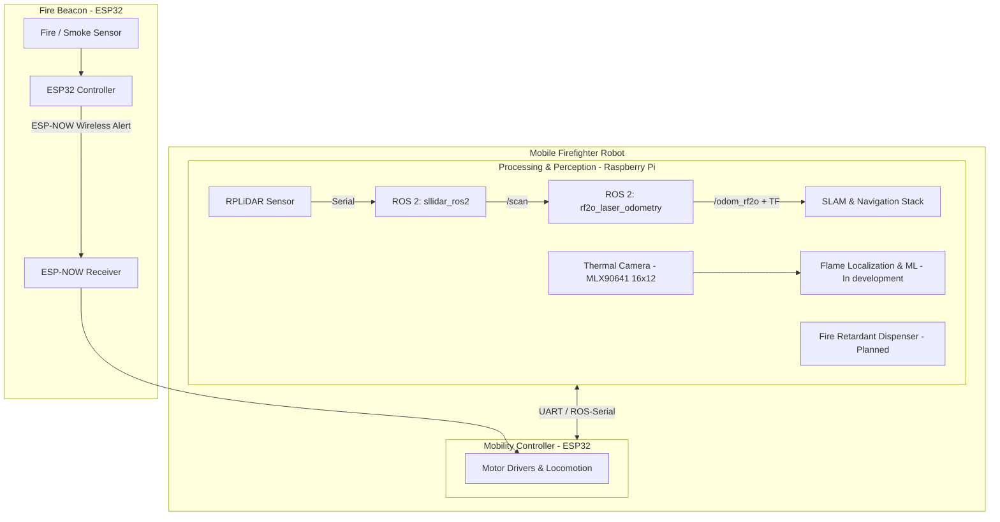

# Autonomous Firefighter Robot (`firefighter_ws`)

An autonomous firefighting robotic system designed for rapid fire detection, navigation, localization, and suppression. The system integrates low-power wireless alert beacons with an autonomous mobile robot equipped with LiDAR SLAM, laser odometry, thermal vision, and a targeted fire retardant delivery system.

---

## Architecture Overview



### 1. Smart Fire Beacon (ESP32)
* **Function**: Acts as a remote smoke / heat detector placed in monitored rooms.
* **Communication**: Transmits low-latency, low-power alert signals to the robot over **ESP-NOW** when fire or smoke is detected.

### 2. Autonomous Mobile Robot
The robot is built with a dual-controller architecture:
* **Raspberry Pi (High-Level Computing & Perception)**:
  * Runs ROS 2 (Jazzy) for sensor processing, LiDAR SLAM, mapping, path planning, and ML workloads.
  * Interfaces with the LiDAR for real-time laser odometry and 2D environmental mapping.
  * Thermal imaging with a **Melexis MLX90641** (16 × 12 = 192-pixel) IR array on
    I²C (`0x33`) to pinpoint the base of the flame — driver verified, perception in
    development (see [`docs/thermal-camera.md`](docs/thermal-camera.md)).
* **ESP32 (Mobility & Hardware Control)**:
  * Handles low-level motor drivers, wheel velocity control, and wheel odometry.
  * Maintains the ESP-NOW communication link with fire alert beacons.

---

## System Operational Workflow

1. **Detection & Alert**: An ESP32 beacon senses smoke/fire and dispatches a beacon alert packet via ESP-NOW.
2. **Dispatch & Navigation**: The robot receives the alert and uses LiDAR-based SLAM and odometry (`rf2o_laser_odometry`) to navigate autonomously to the reported room.
3. **Flame Localization**: Once in proximity, the onboard **MLX90641** thermal camera (16 × 12 IR array) scans the area to pinpoint the exact fire source.
4. **Fire Suppression**: The robot positions itself and activates the fire retardant dispensing mechanism to extinguish the flames.

---

## Current Repository Status

| Component | Hardware / Software | Status | Description |
|---|---|---|---|
| **LiDAR Driver** | RPLiDAR + `sllidar_ros2` | ✅ Implemented | Reads LiDAR data and publishes `/scan` topic |
| **Laser Odometry** | `rf2o_laser_odometry` | ✅ Implemented | Computes planar odometry (`/odom_rf2o`, `odom → base_link` TF) |
| **Live LiDAR Terminal Viewer** | `scripts/ascii_lidar_view.py` | ✅ Implemented | Headless polar ASCII radar visualizer for `/scan` |
| **Operations Dashboard** | `scripts/robot_dashboard.py` | ✅ Implemented | One web page: LiDAR 2D/3D, optional SLAM map and thermal camera feeds, beacon alerts + RSSI, ESP32 link/mode/e-stop, mission state, odometry, per-topic rates, event log |
| **Motor Bench Test** | `scripts/motor_test.py` | ✅ Implemented | Drives the motors from the Pi via `/cmd_vel` (scripted or keyboard) with `/wheel_odom` feedback |
| **Thermal Frame Capture/Render** | `scripts/thermal_frames.py` + `scripts/thermal/` | ✅ Implemented | Captures Melexis **MLX90641** frames and renders PNG heat maps (see [`docs/thermal-camera.md`](docs/thermal-camera.md)) |
| **Pi ↔ ESP32 Serial Bridge** | `firefighter_bridge` (ament_python) | ✅ Implemented | Framed UART link: `/cmd_vel` → `SET_TWIST`, wheel odom, beacon events (see [`src/firefighter_bridge/`](src/firefighter_bridge/README.md)) |
| **Mission Behaviour FSM** | `firefighter_mission` (ament_python) | ✅ Implemented | `beacon → navigate → search → suppress → verify` state machine, e-stop, bounded timeouts (see [`src/firefighter_mission/`](src/firefighter_mission/README.md)) |
| **ESP-NOW Fire Beacon** | ESP32 + Flame/Smoke Sensors | ✅ Implemented | HL-01 flame + MQ-2 smoke sensing with detection latching, non-blocking 2 s ESP-NOW alert transmission (see [`firmware/`](firmware/README.md)) |
| **Robot Mobility Controller** | ESP32 + Motor Drivers | ✅ In Firmware | Motor control firmware and ESP-NOW receiver (see [`firmware/`](firmware/README.md)) |
| **SLAM & Path Planning** | `slam_toolbox` + Nav2 + `robot_localization` | ✅ Implemented | Mapping, EKF fusion (`/odom_rf2o` + `/wheel_odom`) and Nav2 path planning (see [`src/firefighter_bringup/`](src/firefighter_bringup/README.md)) |
| **Thermal Flame Localization**| Melexis **MLX90641** (16 × 12) + ML model | ✅ Implemented | 16×12 IR array → thermal image + bearing/range to the flame (see [`src/firefighter_perception/`](src/firefighter_perception/README.md)); ML model still pending |
| **Fire Retardant Dispenser** | Actuator / Pump / Nozzle | ⏳ Planned | Automated fire suppression dispenser |

### Upstream ROS 2 Packages

The following packages are included in `src/`:

* [`sllidar_ros2`](src/sllidar_ros2/) from [Slamtec/sllidar_ros2](https://github.com/Slamtec/sllidar_ros2)
* [`rf2o_laser_odometry`](src/rf2o_laser_odometry/) from [MAPIRlab/rf2o_laser_odometry](https://github.com/MAPIRlab/rf2o_laser_odometry)

---

## Getting Started (ROS 2 Workspace)

### 1. Build the Workspace

Ensure ROS 2 (Jazzy) is installed and sourced.

> [!WARNING]
> On this Raspberry Pi 4, do **not** run a bare `colcon build --symlink-install`.
> colcon runs each package as `cmake --build ... -- -j4 -l4` and builds packages
> in parallel, i.e. up to 8 concurrent `g++` jobs on a 4-core board with 3.7 GB
> RAM and **no swap**, while the VS Code remote server is resident. That drives
> the system into memory pressure, whose writeback wedges the SD/MMC controller
> (`mmc_rescan` blocked >120 s). Since the root filesystem *and* the Wi-Fi radio
> both hang off that MMC/SDIO bus, the Pi loses disk I/O and networking at the
> same time — SSH drops and can't reconnect, and only a power cycle recovers it.

Use the wrapper instead, which caps compiler parallelism and builds one package
at a time:

```bash
cd ~/firefighter_ws
./build.sh
```

Equivalent to running the following by hand:

```bash
cd ~/firefighter_ws
source /opt/ros/jazzy/setup.bash
MAKEFLAGS="-j1 -l1" colcon build --symlink-install --executor sequential
source install/setup.bash
```

`install/setup.bash` only appears once a build finishes successfully — if
`sourcing install/setup.bash` fails, the previous build did not complete.

#### Recommended Pi hardening (prevents the lockups entirely)

The build wrapper avoids *triggering* the fault; these steps make the board
robust if it happens for another reason:

```bash
# 1. zram swap: compressed swap in RAM, so memory pressure never turns into
#    SD-card writeback. Cheap and safe on a Pi.
sudo apt install zram-tools
#    then set ALGO=zstd and PERCENT=50 in /etc/default/zramswap and
#    sudo systemctl restart zramswap

# 2. earlyoom: kills the biggest memory hog before the box wedges, instead of
#    hanging until the MMC controller gives up.
sudo apt install earlyoom
```

Also worth doing:

- **Put the root filesystem on a USB SSD** (or at least a better SD card). This
  unit's card reports as a generic `SD32G` in DDR50 mode, and cheap cards stall
  under sustained writeback — the actual trigger here.
- **Disable Wi-Fi power save** (`iw dev wlan0 set power_save off`, or the
  NetworkManager `wifi.powersave 2` setting) or, better, **use Ethernet**. SSH
  currently runs over a Wi-Fi hotspot, and the radio shares the MMC/SDIO bus
  with the SD card, so a storage stall also kills the network link.

---

### 2. Launch the LiDAR Driver

```bash
ros2 launch sllidar_ros2 sllidar_a1_launch.py serial_port:=/dev/ttyUSB0
```

### 3. Launch Laser Odometry

```bash
ros2 launch rf2o_laser_odometry rf2o_laser_odometry.launch.py
```

### 4. Optional: Terminal ASCII LiDAR Visualizer

For headless debugging over SSH:

```bash
python3 scripts/ascii_lidar_view.py
```

### 5. Optional: Operations Dashboard (browser)

`scripts/robot_dashboard.py` serves a single page with everything the robot is
doing: the live LiDAR scan (2D and optional 3D), beacon alerts with RSSI and an
estimated range, the mobility ESP32's link/mode/e-stop state, the mission FSM
state and suppression, wheel vs laser odometry, a per-topic rate and freshness
table, and a rolling event log.

```bash
cd ~/firefighter_ws && source install/setup.bash
python3 scripts/robot_dashboard.py
```

Open `http://<pi-ip>:8080/` from a browser on the same network. The 3D view can
display a `PointCloud2` topic when configured:

```bash
python3 scripts/robot_dashboard.py --pointcloud-topic /points
```

The RPLIDAR publishes planar `LaserScan` data, so without a `PointCloud2` topic
the 3D view shows the scan as a flat plane. The server has no authentication and
binds to all interfaces; use it only on a trusted network.

### 6. Optional: Drive the Motors (bench test)

`scripts/motor_test.py` is a bring-up tool for the drive train. It publishes
`/cmd_vel`, which `firefighter_bridge` streams to the ESP32 as `SET_TWIST`, and
reports `/wheel_odom` back so you can see the wheels turning.

```bash
cd ~/firefighter_ws && source install/setup.bash

# creep forward for 2 s, then stop
python3 scripts/motor_test.py --linear 0.10 --duration 2

# spin in place
python3 scripts/motor_test.py --angular 0.5 --duration 3

# keyboard driving: w/s = speed, a/d = turn, space = stop, q = quit
python3 scripts/motor_test.py --interactive
```

> **Stop `firefighter_mission` first.** It also publishes `/cmd_vel`, so the two
> will fight over the motors.

Put the robot on blocks for the first run. Zero is published on every exit path,
and killing the script stops the robot anyway (the bridge zeros stale commands
after `cmd_timeout_s`, and the ESP32 stops itself after `PI_TIMEOUT_MS`).
Add `--estop` to latch a stop on the ESP32 when the test finishes.

For detailed setup, troubleshooting, and port configuration, refer to [`docs/runbook.md`](docs/runbook.md).
