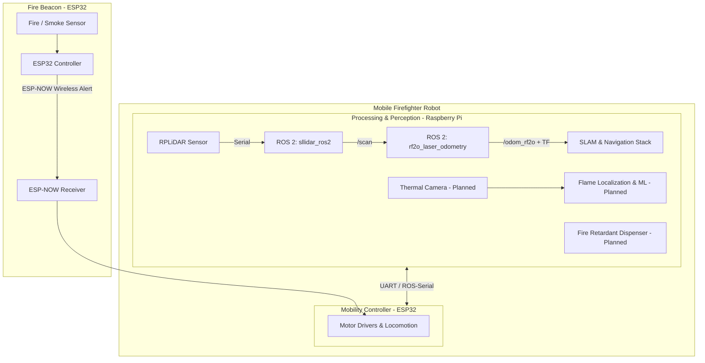

# Autonomous Firefighter Robot (`firefighter_ws`)

An autonomous firefighting robotic system designed for rapid fire detection, navigation, localization, and suppression. The system integrates low-power wireless alert beacons with an autonomous mobile robot equipped with LiDAR SLAM, laser odometry, thermal vision, and a targeted fire retardant delivery system.

---

## Architecture Overview



### 1. Smart Fire Beacon (ESP32)
* **Function**: Acts as a remote smoke / heat detector placed in monitored rooms.
* **Communication**: Transmits low-latency, low-power alert signals to the robot over **ESP-NOW** when fire or smoke is detected.

### 2. Autonomous Mobile Robot
The robot is built with a dual-controller architecture:
* **Raspberry Pi (High-Level Computing & Perception)**:
  * Runs ROS 2 (Jazzy) for sensor processing, LiDAR SLAM, mapping, path planning, and ML workloads.
  * Interfaces with the LiDAR for real-time laser odometry and 2D environmental mapping.
  * Thermal image processing to pinpoint the exact location and base of the flame (*in development*).
* **ESP32 (Mobility & Hardware Control)**:
  * Handles low-level motor drivers, wheel velocity control, and wheel odometry.
  * Maintains the ESP-NOW communication link with fire alert beacons.

---

## System Operational Workflow

1. **Detection & Alert**: An ESP32 beacon senses smoke/fire and dispatches a beacon alert packet via ESP-NOW.
2. **Dispatch & Navigation**: The robot receives the alert and uses LiDAR-based SLAM and odometry (`rf2o_laser_odometry`) to navigate autonomously to the reported room.
3. **Flame Localization**: Once in proximity, an onboard thermal camera scans the area to pinpoint the exact fire source.
4. **Fire Suppression**: The robot positions itself and activates the fire retardant dispensing mechanism to extinguish the flames.

---

## Current Repository Status

| Component | Hardware / Software | Status | Description |
|---|---|---|---|
| **LiDAR Driver** | RPLiDAR + `sllidar_ros2` | ✅ Implemented | Reads LiDAR data and publishes `/scan` topic |
| **Laser Odometry** | `rf2o_laser_odometry` | ✅ Implemented | Computes planar odometry (`/odom_rf2o`, `odom → base_link` TF) |
| **Live LiDAR Terminal Viewer** | `scripts/ascii_lidar_view.py` | ✅ Implemented | Headless polar ASCII radar visualizer for `/scan` |
| **Pi ↔ ESP32 Serial Bridge** | `firefighter_bridge` (ament_python) | ✅ Implemented | Framed UART link: `/cmd_vel` → `SET_TWIST`, wheel odom, beacon events (see [`src/firefighter_bridge/`](src/firefighter_bridge/README.md)) |
| **ESP-NOW Fire Beacon** | ESP32 + Smoke/Heat Sensor | 🚧 Planned / In Development | Sensor trigger and wireless alert transmission (see [`firmware/`](firmware/README.md)) |
| **Robot Mobility Controller** | ESP32 + Motor Drivers | ✅ In Firmware | Motor control firmware and ESP-NOW receiver (see [`firmware/`](firmware/README.md)) |
| **SLAM & Path Planning** | Nav2 / SLAM Toolbox | 🚧 In Progress | Autonomous navigation and dynamic obstacle avoidance |
| **Thermal Flame Localization**| Thermal Camera + ML Model | ⏳ Planned | Infrared imaging and flame coordinate targeting |
| **Fire Retardant Dispenser** | Actuator / Pump / Nozzle | ⏳ Planned | Automated fire suppression dispenser |

---

## Getting Started (ROS 2 Workspace)

### 1. Build the Workspace

Ensure ROS 2 (Jazzy) is installed and sourced.

> [!WARNING]
> On this Raspberry Pi 4, do **not** run a bare `colcon build --symlink-install`.
> colcon runs each package as `cmake --build ... -- -j4 -l4` and builds packages
> in parallel, i.e. up to 8 concurrent `g++` jobs on a 4-core board with 3.7 GB
> RAM and **no swap**, while the VS Code remote server is resident. That drives
> the system into memory pressure, whose writeback wedges the SD/MMC controller
> (`mmc_rescan` blocked >120 s). Since the root filesystem *and* the Wi-Fi radio
> both hang off that MMC/SDIO bus, the Pi loses disk I/O and networking at the
> same time — SSH drops and can't reconnect, and only a power cycle recovers it.

Use the wrapper instead, which caps compiler parallelism and builds one package
at a time:

```bash
cd ~/firefighter_ws
./build.sh
```

Equivalent to running the following by hand:

```bash
cd ~/firefighter_ws
source /opt/ros/jazzy/setup.bash
MAKEFLAGS="-j1 -l1" colcon build --symlink-install --executor sequential
source install/setup.bash
```

`install/setup.bash` only appears once a build finishes successfully — if
`sourcing install/setup.bash` fails, the previous build did not complete.

#### Recommended Pi hardening (prevents the lockups entirely)

The build wrapper avoids *triggering* the fault; these steps make the board
robust if it happens for another reason:

```bash
# 1. zram swap: compressed swap in RAM, so memory pressure never turns into
#    SD-card writeback. Cheap and safe on a Pi.
sudo apt install zram-tools
#    then set ALGO=zstd and PERCENT=50 in /etc/default/zramswap and
#    sudo systemctl restart zramswap

# 2. earlyoom: kills the biggest memory hog before the box wedges, instead of
#    hanging until the MMC controller gives up.
sudo apt install earlyoom
```

Also worth doing:

- **Put the root filesystem on a USB SSD** (or at least a better SD card). This
  unit's card reports as a generic `SD32G` in DDR50 mode, and cheap cards stall
  under sustained writeback — the actual trigger here.
- **Disable Wi-Fi power save** (`iw dev wlan0 set power_save off`, or the
  NetworkManager `wifi.powersave 2` setting) or, better, **use Ethernet**. SSH
  currently runs over a Wi-Fi hotspot, and the radio shares the MMC/SDIO bus
  with the SD card, so a storage stall also kills the network link.

---

### 2. Launch the LiDAR Driver

```bash
ros2 launch sllidar_ros2 sllidar_a1_launch.py serial_port:=/dev/ttyUSB0
```

### 3. Launch Laser Odometry

```bash
ros2 launch rf2o_laser_odometry rf2o_laser_odometry.launch.py
```

### 4. Optional: Terminal ASCII LiDAR Visualizer

For headless debugging over SSH:

```bash
python3 scripts/ascii_lidar_view.py
```

For detailed setup, troubleshooting, and port configuration, refer to [`docs/runbook.md`](docs/runbook.md).
