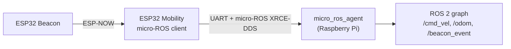

# Option B — micro-ROS on the Mobility ESP32 (deferred)

> **Status: not implemented.** The project currently ships **Option A** — a custom
> framed binary protocol over UART (`firefighter_protocol.h` + a Pi-side bridge
> node). This document exists so we can switch later without re-deriving the design.

---

## Why this is parked, not chosen

Option A won because it keeps the ESP32 firmware small, debuggable with any serial
monitor, and free of a heavyweight middleware. Option B becomes attractive if the
ROS 2 side grows (Nav2 integration, TF trees, action interfaces) and hand-maintaining
a custom protocol becomes the bottleneck.

---

## What changes conceptually

| | Option A (current) | Option B (micro-ROS) |
|---|---|---|
| ESP32 speaks | custom binary frames | ROS 2 (CDR) natively |
| Pi-side component | your `firefighter_bridge` node | `micro_ros_agent` (generic) |
| Topics/messages | defined by the frame IDs in `firefighter_protocol.h` | defined by `.msg` files / standard interfaces |
| Serial port owner | the bridge node | the micro-ROS agent |
| Firmware size | small | larger (client library, allocator, RMW) |



The ESP-NOW beacon path **does not change** — the ESP32 still receives beacon packets
and republishes them as a ROS 2 topic.

---

## Prerequisites

### Raspberry Pi
```bash
# Jazzy agent (preferred if packaged for your distro)
sudo apt install ros-jazzy-micro-ros-agent
# otherwise build from source with the micro-ROS setup tool
#   ros2 run micro_ros_setup create_agent_ws.sh && ros2 run micro_ros_setup build_agent.sh
```

### ESP32 toolchain
Add the **`micro_ros_arduino`** library (Arduino IDE → Library Manager, or vendor it
into the sketch folder). It must be built with the same ESP32 Arduino core you flash
with (2.0.x here).

---

## Wiring

Identical to Option A — the physical link is unchanged:

| Pi | ESP32 |
|---|---|
| GPIO14 (TXD) | GPIO16 (RX) |
| GPIO15 (RXD) | GPIO17 (TX) |
| GND | GND |

UART1 (GPIO9/10) must **not** be used — wired to flash on WROOM modules.

> **Alternative transport:** because both boards have Wi-Fi, micro-ROS can also run
> over UDP (`rmw_microxrcedds` + `micro_ros_agent udp4 --port 8888`) with no cable at
> all. Trade-off: shared 2.4 GHz band with ESP-NOW and the Wi-Fi hotspot, and more
> latency jitter than a dedicated wire.

---

## Steps

### 1. Configure the micro-ROS transport (Pi side config, compiled into the ESP32)
Point the serial transport at UART2 pins, e.g. in the sketch before `setup()`:

```cpp
#define MICROROS_TRANSPORT_UART_PORT 2
#define MICROROS_TRANSPORT_SERIAL_INTERFACE 17   // TX
#define MICROROS_TRANSPORT_SERIAL_INTERFACE_RX 16 // RX
#include <micro_ros_arduino.h>
```

### 2. Flash a micro-ROS node
Replace the UART gateway code in `robot_mobility.ino` with a `rclc` executor node that:

- subscribes `geometry_msgs/Twist` → drives `setMotor(1/2, …)` (reuse the same motor helpers)
- publishes `nav_msgs/Odometry` → from the same `motor1_encoder_count` / `motor2_encoder_count`
- publishes `firefighter_interfaces/BeaconEvent` → from `OnDataRecv` (keep the ESP-NOW callback)
- keeps the **same watchdog**: if no `Twist` for `PI_TIMEOUT_MS`, `stopMotors()`

### 3. Run the agent on the Pi
```bash
source /opt/ros/jazzy/setup.bash
# free the port first (see runbook.md): disable serial console, chmod the device
ros2 run micro_ros_agent micro_ros_agent serial --dev /dev/ttyAMA0 -b 115200
```

### 4. Verify
```bash
ros2 node list        # should show the ESP32's node
ros2 topic hz /odom_wheels
ros2 topic pub /cmd_vel geometry_msgs/msg/Twist "{linear: {x: 0.1}}" -r 10
```

---

## Topic mapping (Option B)

| Direction | Topic | Type |
|---|---|---|
| Pi → ESP32 | `/cmd_vel` | `geometry_msgs/msg/Twist` |
| ESP32 → Pi | `/odom_wheels` | `nav_msgs/msg/Odometry` |
| ESP32 → Pi | `/beacon_event` | `firefighter_interfaces/msg/BeaconEvent` |
| ESP32 → Pi | `/diagnostics` | `diagnostic_msgs/msg/DiagnosticArray` |

This replaces, respectively, `MSG_SET_TWIST`, `MSG_WHEEL_ODOM`, `MSG_BEACON_EVENT`
and `MSG_STATUS` from `firefighter_protocol.h`.

---

## Trade-offs

**Pros**
- No custom framing/CRC code to maintain; standard tools (`ros2 topic`, rqt, Foxglove).
- `Twist`/`Odometry` drop straight into Nav2 and TF.
- The ESP32 becomes a first-class node — easier multi-robot / multiple-ESP32 setups.

**Cons**
- Larger, slower-to-build firmware; more RAM/flash pressure on the ESP32.
- The number of RX/TX buffers and the agent lifecycle add failure modes (agent down = robot silent).
- Harder to debug bare-metal: a bad allocator or transport config can wedge the node.
- The agent takes exclusive ownership of the serial port.

---

## Migration path (when to switch)

Switch if **two or more** of these become true:
1. You need Nav2 actions/services, not just a velocity stream.
2. More than one ESP32 joins the robot and you want them all as ROS nodes.
3. The custom protocol needs new message types more than ~once a month.
4. You want to inspect live data in Foxglove/rqt without writing a decoder.

Keeping the ESP-NOW beacon callback and the motor/encoder helper functions unchanged
makes the switch mostly a transport-layer swap.
