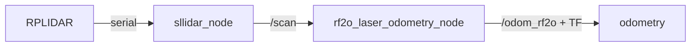

# Running the LiDAR Odometry Workspace

ROS 2 workspace (`~/firefighter_ws`) with two packages:

- **`sllidar_ros2`** — SLAMTEC RPLIDAR driver. Reads the LiDAR over serial and publishes `sensor_msgs/LaserScan` on `/scan`.
- **`rf2o_laser_odometry`** — RF2O planar laser odometry. Subscribes to `/scan`, publishes `nav_msgs/Odometry` on `/odom_rf2o` and broadcasts TF `odom → base_link`.



---

## 1. Build

> **Do not run a bare `colcon build --symlink-install` on this Pi 4.**
> colcon invokes each package as `cmake --build ... -- -j4 -l4` and builds both
> packages concurrently — up to 8 `g++` jobs on a 4-core board with 3.7 GB RAM
> and no swap. The resulting memory pressure wedges the SD/MMC controller, and
> because the root filesystem *and* the Wi-Fi radio share the MMC/SDIO bus, the
> Pi simultaneously loses disk I/O and networking. SSH drops, cannot reconnect,
> and the board must be power-cycled.

Prefer the wrapper, which caps the build to one compiler job and one package at
a time:

```bash
cd ~/firefighter_ws
./build.sh
```

The underlying command it runs:

```bash
cd ~/firefighter_ws
source /opt/ros/jazzy/setup.bash
MAKEFLAGS="-j1 -l1" colcon build --symlink-install --executor sequential
source install/setup.bash
```

`JOBS=2 ./build.sh` is usually still safe if the Pi is otherwise idle.

See [README → Build the Workspace](README.md#1-build-the-workspace) for the
hardening steps (zram swap, `earlyoom`, USB-SSD root) that make builds robust.

---

## 2. Find the LiDAR port

```bash
ls -l /dev/ttyUSB* /dev/ttyACM* /dev/serial/by-id/ 2>/dev/null
```

| Wiring | Port |
|---|---|
| USB adapter (typical RPLIDAR dongle) | `/dev/ttyUSB0` |
| Direct to GPIO pins 8 (TXD) / 10 (RXD) | `/dev/ttyS0` |

Prefer the stable by-id path so the number doesn't change:

```bash
ls -l /dev/serial/by-id/
```

---

## 3. Permissions (if needed)

```bash
sudo chmod 777 /dev/ttyUSB0
```

---

## 4. Run the LiDAR driver

```bash
cd ~/firefighter_ws && source install/setup.bash
ros2 launch sllidar_ros2 sllidar_a1_launch.py serial_port:=/dev/ttyUSB0
```

Use the launch file that matches your model (e.g. `sllidar_a2m8_launch.py`, `sllidar_s1_launch.py`, …). Note different models use different `serial_baudrate`.

### Start the motor (if no scan appears)

The A1 motor doesn't always auto-start. If `/scan` stays silent:

```bash
ros2 service call /start_motor std_srvs/srv/Empty "{}"
```

### Verify data is flowing

```bash
ros2 topic hz /scan          # should show ~7–10 Hz
ros2 topic echo /scan --once # should print a LaserScan message
```

---

## 5. Run the odometry

```bash
cd ~/firefighter_ws && source install/setup.bash
ros2 launch rf2o_laser_odometry rf2o_laser_odometry.launch.py
```

The node looks up the transform `base_link → laser`, so add a static transform for the LiDAR's physical offset on the robot (zero here; adjust to your mount):

```bash
ros2 run tf2_ros static_transform_publisher 0 0 0 0 0 0 base_link laser
```

Defaults: reads `/scan`, publishes `/odom_rf2o`, TF `odom → base_link`.

---

## 6. Viewing the data

### Foxglove Studio (recommended, works headless over SSH)

```bash
source /opt/ros/jazzy/setup.bash
ros2 launch foxglove_bridge foxglove_bridge_launch.xml port:=8765
```

Then open <https://studio.foxglove.dev/> in a browser, connect to `ws://<pi-ip>:8765`, and add a **3D** panel with topic `/scan` (frame `laser`).

### ASCII radar view (terminal, no display needed)

```bash
cd ~/firefighter_ws && source install/setup.bash && python3 scripts/ascii_lidar_view.py
```

### Operations dashboard (browser)

Run the server on the Pi after sourcing the ROS 2 workspace:

```bash
cd ~/firefighter_ws && source install/setup.bash
python3 scripts/robot_dashboard.py
```

From a browser on the same trusted network, open `http://<pi-ip>:8080/`.

The page shows the LiDAR scan (2D, plus an optional 3D view) alongside the
robot's operational state: beacon alerts with RSSI and an estimated range, the
mobility ESP32's link / mode / e-stop flags, the mission FSM state and
suppression, wheel (`/wheel_odom`) vs laser (`/odom_rf2o`) odometry, a per-topic
rate and freshness table, and a rolling event log. A row of status tiles under
the header sums up mission, flame, beacon, drive, speed and battery at a glance,
and the LiDAR view is drawn with the robot's forward direction up. Anything that needs attention
is raised as a banner at the top: fire / smoke, a latched e-stop, an encoder
fault, a stale or down ESP32 link, an aborted mission. While a flame is being
tracked, its bearing and range are drawn on the 2D scan.

If the page loses the dashboard server it says `DASHBOARD OFFLINE` and dims
every panel - the values underneath are the last ones received, not live. The
LiDAR view is labelled the same way when `/scan` stops arriving.

For volumetric LiDAR data, pass a `PointCloud2` topic such as:

```bash
python3 scripts/robot_dashboard.py --pointcloud-topic /points
```

This RPLIDAR publishes planar `LaserScan` data; its 3D view is therefore flat
unless another node publishes a `PointCloud2`. Every watched topic can be
overridden (`--scan-topic`, `--beacon-topic`, `--odom-topic`,
`--diagnostics-topic`, ...) - run with `--help` for the full list. The server
binds to all network interfaces on port 8080 and has no authentication, so only
run it on a trusted network.

### Tweakable parameters

```bash
python3 scripts/ascii_lidar_view.py --ros-args \
  -p scan_topic:=/scan \
  -p max_range:=10.0 \
  -p size:=61 \
  -p rate:=15.0
```

| Param | Default | Meaning |
|---|---|---|
| `scan_topic` | `/scan` | LaserScan topic to read |
| `max_range` | `6.0` | View radius in meters |
| `size` | `41` | Grid width/height in characters |
| `rate` | `10.0` | Refresh rate (Hz) |

### RViz2 (needs a display)

```bash
rviz2 -d $(ros2 pkg prefix sllidar_ros2)/share/sllidar_ros2/rviz/sllidar_ros2.rviz
```

---

## Troubleshooting

- **`colcon: command not found`** — `sudo apt install python3-colcon-common-extensions`
- **No `/dev/ttyUSB*`** — check the USB cable/power; `lsusb` should show a `CP210x` / `CH340` / `FTDI` device.
- **Node runs but no scan** — call `/start_motor` (see §4).
- **Scan freezes after a while** — the motor has stalled; call `/start_motor` again, or power the LiDAR from a powered USB hub.

---

## 7. Full stack (SLAM + Nav2 + mission)

The whole robot comes up from one launch file:

```bash
cd ~/firefighter_ws && ./build.sh && source install/setup.bash
ros2 launch firefighter_bringup bringup.launch.py
```

That starts the LiDAR, `rf2o`, the `robot_localization` EKF, the ESP32 bridge,
thermal perception, SLAM Toolbox, Nav2, the mission FSM and RViz. See
[`src/firefighter_bringup/README.md`](../src/firefighter_bringup/README.md) for the
full argument list and the TF-ownership diagram.

```bash
# mapping only, no Nav2
ros2 launch firefighter_bringup bringup.launch.py nav2_enabled:=false

# save the map once you have driven around
ros2 run nav2_map_server map_saver_cli -f ~/firefighter_ws/maps/map

# later: localize against the saved map instead of mapping
ros2 launch firefighter_bringup bringup.launch.py slam:=false
```

### TF ownership

Exactly one node publishes each transform. This is the thing that most often goes
wrong:

```
map ──(slam_toolbox)──> odom ──(EKF)──> base_link ──(static)──> laser
                                                └──(static)──> thermal_camera
```

`rf2o` and the bridge both publish odometry with `publish_tf: false` precisely so
the EKF can own `odom → base_link`. Running the old `rf2o_laser_odometry.launch.py`
(which defaults to `publish_tf: true`) **alongside** the bringup file will give
`base_link` two parents — check `ros2 node list` if TF looks unstable.

### Checking it is healthy

```bash
ros2 run tf2_tools view_frames          # one parent per frame
ros2 topic hz /scan /odometry/filtered /thermal/image
ros2 lifecycle get /slam_toolbox /controller_server /planner_server
ros2 topic echo /firefighter_mission/state
```
