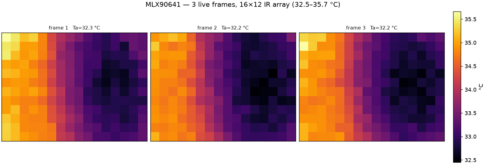

# Thermal Camera — Melexis MLX90641

> **Status:** sensor identified and **verified working** (2026-10-07).
> Thermal perception / ML integration is still pending.

## 1. What the robot actually carries

| Property | Value |
|---|---|
| Part | **Melexis MLX90641** — 16 × 12 = **192-pixel** IR array |
| Bus / address | I²C bus 1 (`/dev/i2c-1`), address **`0x33`** |
| Supply | 3.3 V (measured `Vdd ≈ 3.29 V`) |
| Field of view | depends on the lens variant (55°×35° or 110°×70°) |

### Wiring (Raspberry Pi 40-pin header)

A 4-wire I²C device on the Pi's primary I²C bus (`i2c-1`). GPIO2/GPIO3 already
have pull-ups on the Pi, so **no external resistors are needed**.

| MLX90641 | Pi signal | GPIO | Physical pin |
|---|---|---|---|
| VCC | 3V3 | — | 1 (or 17) |
| GND | GND | — | 6 (or 9, 14, 20, 25, 30, 34, 39) |
| SDA | I²C1 SDA | GPIO2 | 3 |
| SCL | I²C1 SCL | GPIO3 | 5 |

```text
MLX90641                     Raspberry Pi 40-pin header
  VCC ────────────────────── 3V3    (pin 1 / 17)
  GND ────────────────────── GND    (pin 6 / 9 / 14 / 20 / 25 / 30 / 34 / 39)
  SDA ────────────────────── GPIO2  (pin 3)   I2C1 SDA
  SCL ────────────────────── GPIO3  (pin 5)   I2C1 SCL
```

> GPIO2/GPIO3 are the dedicated I²C1 pins, enabled by `dtparam=i2c_arm=on` in
> `/boot/firmware/config.txt`. Verify the wiring with `i2cdetect -y 1` — the
> sensor must answer at **`0x33`**.

The project originally assumed the robot carried a **Melexis MLX90640 (32 × 24 =
768 px)** — that assumption is baked into the old `adafruit-circuitpython-mlx90640`
dependency and the README. **It is incorrect.**

The MLX90640 and MLX90641 are pin- and I²C-compatible:

* same I²C address `0x33`,
* same register map (`EEPROM @ 0x2400`, pixel RAM `@ 0x0400`, control `@ 0x800D`,
  status `@ 0x8000`),

but they have **different EEPROM calibration layouts**. Using the wrong driver
therefore *silently mis-parses* the calibration instead of failing cleanly.

## 2. Identifying which part you have

A plain I²C scan **cannot** distinguish them — both answer at `0x33`. The vendor
libraries use a single EEPROM bit as the device selector:

* EEPROM word index **10** (`eeData[10]`), **bit 6** (`0x40`)
  * **set (1)** → **MLX90641** (`MLX90641_CheckEEPROMValid()` requires it)
  * **clear (0)** → **MLX90640**

On this robot:

```text
$ i2cdetect -y 1              # 0x33 is the only device on the bus
     0  1  2  3  4  5  6  7  8  9  a  b  c  d  e  f
30: -- -- -- 33 -- -- -- -- -- -- -- -- -- -- -- --

eeData[10] = 0x0AD9  ->  bit6 = 1  ->  MLX90641
```

## 3. Symptom with the wrong (MLX90640) driver

`adafruit-circuitpython-mlx90640` fails on this sensor:

```text
RuntimeError: More than 4 outlier pixels     # raised while constructing MLX90640(i2c)
ValueError: math domain error                # later, inside getFrame()
```

**Do not read this as a faulty or counterfeit sensor** — it is a part mismatch.
The hardware is healthy (verified in §5).

## 4. How to read it

There is **no MLX90641 driver on PyPI**. Drive it with the vendor C library
([`melexis/mlx90641-library`](https://github.com/melexis/mlx90641-library)) plus a
small Linux `/dev/i2c-1` backend.

### 4.1 The reader lives in this repo

The reader and its build script are vendored under
[`scripts/thermal/`](../scripts/thermal/):

| File | Purpose |
|---|---|
| `scripts/thermal/mlx90641_frames.cpp` | Linux I²C backend for the vendor API + CSV frame dump |
| `scripts/thermal/build.sh` | clones `melexis/mlx90641-library` (to `$MLX90641_LIB`, default `/tmp/mlx90641lib`) and compiles the reader |
| `scripts/thermal_frames.py` | captures frames and renders PNG heat maps |

The vendor library is the only supported path — there is no MLX90641 package on
PyPI.

### 4.2 The I²C backend (`scripts/thermal/mlx90641_frames.cpp`)

Implements the five functions the vendor API expects
(`MLX90641_I2CInit/Read/Write/GeneralReset/FreqSet`). 16-bit words are **MSB
first**.

```cpp
#include <cstdint>
#include <cstdio>
#include <fcntl.h>
#include <unistd.h>
#include <sys/ioctl.h>
#include <linux/i2c.h>
#include <linux/i2c-dev.h>
#include "MLX90641_I2C_Driver.h"

static int g_fd = -1;
static const char *g_dev = "/dev/i2c-1";

void MLX90641_I2CInit(void) {
    if (g_fd >= 0) return;
    g_fd = open(g_dev, O_RDWR);
    if (g_fd < 0) perror("open /dev/i2c-1");
}

void MLX90641_I2CFreqSet(int) { /* the kernel owns the clock */ }

int MLX90641_I2CGeneralReset(void) {
    if (g_fd < 0) return -1;
    uint8_t cmd[2] = {0x00, 0x06};          // general-call software reset
    if (write(g_fd, cmd, 2) != 2) return -1;
    usleep(1000);
    return 0;
}

int MLX90641_I2CRead(uint8_t slaveAddr, uint16_t startAddress,
                     uint16_t nMemAddressRead, uint16_t *data) {
    if (g_fd < 0) return -1;
    uint8_t addr[2] = {(uint8_t)(startAddress >> 8), (uint8_t)(startAddress & 0xFF)};
    static uint8_t buf[4096];
    if (2u * nMemAddressRead > sizeof(buf)) return -1;

    struct i2c_msg msgs[2];
    msgs[0].addr = slaveAddr; msgs[0].flags = 0;        msgs[0].len = 2;                msgs[0].buf = addr;
    msgs[1].addr = slaveAddr; msgs[1].flags = I2C_M_RD; msgs[1].len = 2 * nMemAddressRead; msgs[1].buf = buf;

    struct i2c_rdwr_ioctl_data xfer = { msgs, 2 };
    if (ioctl(g_fd, I2C_RDWR, &xfer) < 0) return -1;

    for (int i = 0; i < nMemAddressRead; i++)
        data[i] = (uint16_t)buf[2 * i] * 256u + buf[2 * i + 1];
    return 0;
}

int MLX90641_I2CWrite(uint8_t slaveAddr, uint16_t writeAddress, uint16_t data) {
    if (g_fd < 0) return -1;
    uint8_t cmd[4] = {(uint8_t)(writeAddress >> 8), (uint8_t)(writeAddress & 0xFF),
                      (uint8_t)(data >> 8),         (uint8_t)(data & 0xFF)};
    struct i2c_msg msg = { slaveAddr, 0, 4, cmd };
    struct i2c_rdwr_ioctl_data xfer = { &msg, 1 };
    return ioctl(g_fd, I2C_RDWR, &xfer) < 0 ? -1 : 0;
}
```

### 4.3 Frame read loop

The repo reader emits the 16×12 frame as **CSV on stdout** (diagnostics on
stderr); this is the essential loop:

```cpp
#include <cstdio>
#include <cstdint>
#include "MLX90641_API.h"
#include "MLX90641_I2C_Driver.h"

#define ADDR 0x33

int main(void) {
    MLX90641_I2CInit();

    static uint16_t ee[832];
    if (MLX90641_DumpEE(ADDR, ee)) { printf("DumpEE failed\n"); return 1; }
    printf("eeData[10]=0x%04X deviceSelect=%d\n", ee[10], (ee[10] >> 6) & 1);

    static paramsMLX90641 p;
    if (MLX90641_ExtractParameters(ee, &p)) { printf("ExtractParameters failed\n"); return 1; }

    float emissivity = MLX90641_GetEmissivity(&p);
    if (emissivity <= 0.0f || emissivity > 1.0f) emissivity = 0.95f;

    static uint16_t frame[242];
    static float to[192];

    for (int k = 0; k < 3; k++) {
        if (MLX90641_GetFrameData(ADDR, frame) < 0) continue;
        float vdd = MLX90641_GetVdd(frame, &p);
        float ta  = MLX90641_GetTa(frame, &p);
        MLX90641_CalculateTo(frame, &p, emissivity, ta, to);

        float mn = 1e9f, mx = -1e9f, sum = 0;
        for (int i = 0; i < 192; i++) { if (to[i]<mn) mn=to[i]; if (to[i]>mx) mx=to[i]; sum+=to[i]; }
        printf("frame %d: Vdd=%.2fV Ta=%.2fC  Tmin=%.2f Tmax=%.2f Tmean=%.2f  subpage=%d\n",
               k, vdd, ta, mn, mx, sum/192.0f, frame[241]);
    }

    printf("\nThermal image 16x12 (deg C):\n");
    for (int r = 0; r < 12; r++) {
        for (int c = 0; c < 16; c++) printf("%7.1f", to[r * 16 + c]);
        printf("\n");
    }
    return 0;
}
```

### 4.4 Build, run, render

```bash
bash scripts/thermal/build.sh          # clone vendor lib + compile the reader
./scripts/thermal/mlx90641_frames 3    # 3 frames of 16x12 CSV on stdout

uv run scripts/thermal_frames.py -n 3  # capture + render PNGs (default docs/images)
```

> The user account only needs read access to `/dev/i2c-1` (e.g. membership of the
> `i2c` group). No `sudo` is required on this robot.

## 5. Sample frames



Individual frames: [1](images/thermal-frame-01.png) ·
[2](images/thermal-frame-02.png) ·
[3](images/thermal-frame-03.png) — produced by
`uv run scripts/thermal_frames.py -n 3`.

Raw numeric dump from two runs a few seconds apart (a warm object fills the
centre/right):

```text
MLX90641_DumpEE            -> 0
eeData[10]=0x0AD9  deviceSelect(bit6)=1
MLX90641_ExtractParameters -> 0
frame 0: Vdd=3.29V  Ta=32.32C  Tmin=29.24  Tmax=36.23  Tmean=33.43  subpage=0
frame 1: Vdd=3.29V  Ta=32.32C  Tmin=29.15  Tmax=36.14  Tmean=33.33  subpage=1
frame 2: Vdd=3.29V  Ta=32.31C  Tmin=29.22  Tmax=36.29  Tmean=33.40  subpage=0

Thermal image 16x12 (deg C):
   30.0   29.5   29.7   29.8   30.2   31.6   32.5   33.5   34.0   34.4   34.4   34.0   32.7   30.2   29.6   32.1
   29.9   29.5   30.0   29.8   30.6   32.5   33.3   33.9   34.4   34.9   35.0   34.6   34.1   30.0   29.3   31.1
   29.4   30.0   29.2   29.8   31.6   33.1   33.6   34.2   34.8   35.2   35.4   35.1   34.7   31.3   29.2   30.3
   29.7   29.7   29.4   30.4   32.9   33.4   34.0   34.6   35.2   35.5   35.7   35.5   35.0   33.6   29.7   30.2
   29.6   29.6   31.1   31.7   33.2   33.8   34.2   34.7   35.3   35.6   35.9   35.7   35.3   34.6   30.4   30.1
   29.5   29.6   30.1   32.5   33.3   33.8   34.4   34.8   35.4   35.8   35.8   35.7   35.2   34.7   31.8   30.4
   29.7   30.0   31.2   33.3   33.8   34.1   34.6   34.9   35.3   35.7   35.9   35.6   35.4   34.9   33.3   30.6
   29.5   30.3   32.5   33.2   33.9   34.3   34.6   35.2   35.5   35.7   35.7   35.8   35.5   35.0   34.5   31.2
   29.8   30.3   32.8   33.7   34.1   34.5   34.8   35.2   35.6   35.8   35.9   35.8   35.7   35.3   34.9   32.0
   29.4   31.3   33.3   33.6   34.2   34.6   35.0   35.3   35.5   35.8   35.8   35.8   35.8   35.3   35.1   33.0
   30.0   32.5   33.5   33.9   34.4   34.7   35.1   35.5   35.6   36.0   36.0   36.3   36.0   35.5   35.3   33.5
   30.6   33.3   33.6   34.2   34.5   34.8   35.2   35.5   35.9   36.1   36.1   36.1   35.8   35.9   35.4   34.3
```

```text
frame 0: Vdd=3.29V  Ta=32.31C  Tmin=29.22  Tmax=36.22  Tmean=33.38  subpage=1

Thermal image 16x12 (deg C):
   29.8   29.5   29.7   29.7   29.9   31.5   32.4   33.4   34.1   34.5   34.5   34.2   32.5   30.1   29.5   31.9
   29.6   29.5   30.0   29.6   30.6   32.5   33.2   33.8   34.4   34.9   35.2   34.7   33.9   29.8   29.2   31.1
   29.7   29.8   29.4   29.6   31.7   33.2   33.7   34.2   34.9   35.2   35.4   35.1   34.7   31.5   29.4   30.4
   29.6   29.4   29.5   30.4   32.6   33.2   34.0   34.4   35.1   35.6   35.8   35.5   34.9   33.5   29.5   30.1
   29.6   29.7   31.0   31.4   33.1   33.8   34.2   34.6   35.0   35.6   35.8   35.8   35.1   34.6   30.4   30.2
   29.4   29.4   29.9   32.7   33.3   33.8   34.4   34.8   35.1   35.8   35.9   35.6   35.2   34.7   31.7   30.4
   29.7   30.1   31.1   33.2   33.8   34.0   34.5   35.0   35.3   35.6   35.8   35.7   35.1   35.0   33.4   30.8
   29.6   30.1   32.2   33.4   33.8   34.2   34.8   35.2   35.3   35.7   35.9   35.8   35.3   35.2   34.3   31.0
   29.8   30.4   33.1   33.5   34.0   34.5   34.7   35.0   35.5   35.7   36.0   35.7   35.6   35.1   35.0   32.0
   29.4   31.4   33.2   33.7   34.2   34.4   34.9   35.2   35.5   35.7   36.0   35.7   35.7   35.4   35.2   32.8
   29.8   32.6   33.6   33.7   34.4   34.8   35.1   35.4   35.6   35.8   36.0   35.9   35.8   35.5   35.3   33.5
   30.4   33.2   33.8   34.1   34.5   34.9   35.1   35.5   35.6   36.0   36.2   36.1   35.9   35.7   35.7   34.3
```

Notes:

* The **1.0 EEPROM emissivity** means the 192 px are reported as absolute
  temperatures with the sensor's own emissivity (1.0 → ideal black-body). For a
  real flame target, use the EEPROM value (or override, e.g. 0.95) and pass the
  measured ambient `Ta` as the reflected temperature `tr`.

## 6. Integration plan

1. **Drop the wrong dependency.** The thermal sensor is **not** an MLX90640; remove
   `adafruit-circuitpython-mlx90640` from `pyproject.toml` (done).
2. **Add a driver.** No PyPI MLX90641 package exists, so either
   * vendor the small C reader above behind a ROS 2 node, or
   * port the vendor C API (`MLX90641_ExtractParameters` / `CalculateTo`) to Python.
3. **Publish a `sensor_msgs/Image`** (or `firefighter_interfaces/FlameEvent`) from
   the 192-pixel (16 × 12) frame; update the pixel geometry everywhere — **192, not
   768**.
4. **Flame localization** then consumes the thermal image (see
   [`src/firefighter_interfaces/msg/FlameEvent.msg`](../src/firefighter_interfaces/msg/FlameEvent.msg)).

## 7. References

* Vendor library: <https://github.com/melexis/mlx90641-library>
* MLX90641 datasheet: <https://www.melexis.com/en/product/MLX90641>
* MLX90640 (the *other* part — **not** used here): <https://www.melexis.com/en/product/MLX90640>
* Adafruit CircuitPython MLX90640 driver "outlier pixels" issue:
  <https://github.com/adafruit/Adafruit_CircuitPython_MLX90640/issues/19>
