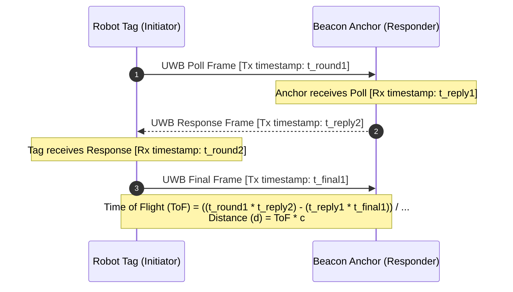

# UWB (Ultra-Wideband) Ranging Migration Guide

This document defines the architecture, hardware integration, protocol changes, and migration roadmap for replacing interim RSSI-based proximity estimation with high-accuracy **Ultra-Wideband (UWB) Time-of-Flight ranging** between the Fire Beacon and the Robot Mobility ESP32.

---

## 1. Executive Summary

| Attribute | Current Interim Method (RSSI) | Target Upgrade (UWB ToF) |
|---|---|---|
| **Technology** | 2.4 GHz ESP-NOW Wi-Fi Signal Strength | IEEE 802.15.4a / 802.15.4z UWB (3.5–6.5 GHz) |
| **Accuracy** | $\pm 3\text{ to } 8\text{ meters}$ (qualitative proximity) | **$\pm 5\text{ to } 10\text{ cm}$ (exact physical distance)** |
| **Multipath Immunity** | Very Low (severe wall/object reflections) | **Very High** (nanosecond pulses isolate direct path) |
| **Smoke/Fire Penetration** | Medium | **High** (RF penetration through smoke and dust) |
| **Hardware Required** | ESP32 on-board Wi-Fi | Decawave DWM1000 or DWM3000 module per ESP32 |
| **Protocol** | `uint8_t rssi` in `MSG_BEACON_EVENT` | Millimeter distance in `MSG_BEACON_EVENT` / `MSG_BEACON_RANGE` |

---

## 2. Hardware Architecture

```mermaid
flowchart LR
    subgraph Beacon [Fire Beacon ESP32]
        Sensor[Flame / Smoke Sensor] --> B_ESP[ESP32 Sender]
        B_ESP <-->|SPI| B_UWB[DWM1000 / DWM3000 Anchor]
    end

    subgraph Robot [Robot Mobility ESP32]
        R_UWB[DWM1000 / DWM3000 Tag] <-->|SPI| R_ESP[ESP32 Receiver / Gateway]
        R_ESP --> Drivers[L298N Motors]
        R_ESP -->|UART2| Pi[Raspberry Pi / ROS 2]
    end

    B_UWB <===>|UWB Two-Way Ranging (ToF)| R_UWB
    B_ESP -.->|ESP-NOW Fallback Alert| R_ESP
```

### Recommended Hardware
* **Decawave DWM1000 / DWM3000** SPI Breakout boards (or Makerfabs ESP32 UWB modules).
* **Operating Band**: Channel 2 (3993.6 MHz) or Channel 5 (6489.6 MHz) for optimal indoor penetration.

### SPI Wiring to ESP32
Ensure these pins do not conflict with motor driver pins (`GPIO 14, 25, 26, 27, 32, 33`), encoders (`GPIO 18, 19, 22, 23`), or UART2 (`GPIO 16, 17`):

| DWM1000 Pin | Beacon ESP32 GPIO | Robot ESP32 GPIO | Function |
|---|---|---|---|
| **VCC** | 3.3V | 3.3V | Power supply (decoupled with 100 nF + 10 µF) |
| **GND** | GND | GND | Common ground |
| **SCK** | GPIO 18 | GPIO 5 | SPI Clock |
| **MISO** | GPIO 19 | GPIO 4 | SPI MISO |
| **MOSI** | GPIO 23 | GPIO 21 | SPI MOSI |
| **CS / NSS**| GPIO 5 | GPIO 15 | SPI Chip Select |
| **IRQ** | GPIO 4 | GPIO 13 | Hardware Interrupt (Rising Edge) |
| **RST** | GPIO 22 | GPIO 12 | Hardware Reset (Active Low) |

---

## 3. Ranging Protocol (Two-Way Ranging / TWR)

Single-Sided (SS-TWR) or Double-Sided (DS-TWR) Two-Way Ranging computes Time-of-Flight without requiring nanosecond clock synchronization:



---

## 4. Software & Firmware Changes

### 4.1 Arduino Library
* Install `DW1000-ng` or `decadriver` in the Arduino / PlatformIO environment.
* Initialize the UWB transceiver in `setup()`:
  ```cpp
  #include <DW1000Ng.hpp>
  // Configure SPI pins and antennas
  DW1000Ng::initialize(PIN_SS, PIN_IRQ, PIN_RST);
  DW1000Ng::setupStorageRegisters();
  ```

### 4.2 Framed Protocol Evolution (`firefighter_protocol.h`)
Update `MSG_BEACON_EVENT` (or introduce `MSG_BEACON_RANGE` `0x86`) to include measured distance in millimeters:

```cpp
// MSG_BEACON_EVENT (0x83):
// Payload (15 bytes):
//   uint32_t messageNumber (4B)
//   uint8_t  fireDetected  (1B)
//   uint8_t  smokeDetected (1B)
//   uint8_t  rssi          (1B)   - Interim Wi-Fi RSSI magnitude
//   uint16_t range_mm      (2B)   - UWB range in millimeters (0 if no UWB lock)
//   uint8_t  mac[6]        (6B)
```

### 4.3 ROS 2 Interface (`BeaconEvent.msg`)
Update `src/firefighter_interfaces/msg/BeaconEvent.msg`:
```text
std_msgs/Header header

uint32 message_number
bool fire_detected
bool smoke_detected
uint8 rssi               # Wi-Fi RSSI magnitude in dBm
float32 distance_m       # UWB distance in meters (0.0 if unavailable)
uint8[6] mac
```

### 4.4 Bridge Node (`firefighter_bridge`)
Unpack `range_mm` from payload and publish `distance_m = event.range_mm / 1000.0`.

---

## 5. Navigation & SLAM Integration

When UWB range is available in ROS 2:
1. **Trilateration / Range-Only SLAM**: With multiple beacons or a moving robot estimating positions over time, range measurements form circles intersecting at the fire source location $(x_f, y_f)$.
2. **Costmap Attraction Layer / Goal Generator**: Autonomously guide `/goal_pose` towards the beacon by driving down the distance gradient.
3. **Sensor Fusion**: Combine 2D LiDAR (`sllidar_ros2`) and laser odometry (`rf2o_laser_odometry`) with UWB range to pin the beacon coordinate onto the `/map` frame.

---

## 6. Migration Checklist

- [ ] Procure 2x Decawave DWM1000 or DWM3000 breakout modules.
- [ ] Connect SPI pins on the Beacon ESP32 and Robot Mobility ESP32 according to the pinout table.
- [ ] Implement Two-Way Ranging (TWR) using the `DW1000Ng` library.
- [ ] Add `range_mm` field to `firefighter_protocol.h` and `BeaconEvent.msg`.
- [ ] Update `protocol.py` codecs and `bridge_node.py` publisher.
- [ ] Add unit tests in `tests/test_protocol_codec.py` for UWB payload serialization.
- [ ] Verify $\pm 10\text{ cm}$ range accuracy in indoor smoke/obstacle test bench.
