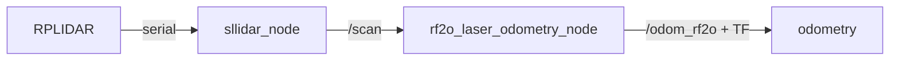

# Running the LiDAR Odometry Workspace

ROS 2 workspace (`~/ros2_ws`) with two packages:

- **`sllidar_ros2`** — SLAMTEC RPLIDAR driver. Reads the LiDAR over serial and publishes `sensor_msgs/LaserScan` on `/scan`.
- **`rf2o_laser_odometry`** — RF2O planar laser odometry. Subscribes to `/scan`, publishes `nav_msgs/Odometry` on `/odom_rf2o` and broadcasts TF `odom → base_link`.



---

## 1. Build

```bash
cd ~/ros2_ws
source /opt/ros/jazzy/setup.bash
colcon build --symlink-install
source install/setup.bash
```

---

## 2. Find the LiDAR port

```bash
ls -l /dev/ttyUSB* /dev/ttyACM* /dev/serial/by-id/ 2>/dev/null
```

| Wiring | Port |
|---|---|
| USB adapter (typical RPLIDAR dongle) | `/dev/ttyUSB0` |
| Direct to GPIO pins 8 (TXD) / 10 (RXD) | `/dev/ttyS0` |

Prefer the stable by-id path so the number doesn't change:

```bash
ls -l /dev/serial/by-id/
```

---

## 3. Permissions (if needed)

```bash
sudo chmod 777 /dev/ttyUSB0
```

---

## 4. Run the LiDAR driver

```bash
cd ~/ros2_ws && source install/setup.bash
ros2 launch sllidar_ros2 sllidar_a1_launch.py serial_port:=/dev/ttyUSB0
```

Use the launch file that matches your model (e.g. `sllidar_a2m8_launch.py`, `sllidar_s1_launch.py`, …). Note different models use different `serial_baudrate`.

### Start the motor (if no scan appears)

The A1 motor doesn't always auto-start. If `/scan` stays silent:

```bash
ros2 service call /start_motor std_srvs/srv/Empty "{}"
```

### Verify data is flowing

```bash
ros2 topic hz /scan          # should show ~7–10 Hz
ros2 topic echo /scan --once # should print a LaserScan message
```

---

## 5. Run the odometry

```bash
cd ~/ros2_ws && source install/setup.bash
ros2 launch rf2o_laser_odometry rf2o_laser_odometry.launch.py
```

The node looks up the transform `base_link → laser`, so add a static transform for the LiDAR's physical offset on the robot (zero here; adjust to your mount):

```bash
ros2 run tf2_ros static_transform_publisher 0 0 0 0 0 0 base_link laser
```

Defaults: reads `/scan`, publishes `/odom_rf2o`, TF `odom → base_link`.

---

## 6. Viewing the data

### Foxglove Studio (recommended, works headless over SSH)

```bash
source /opt/ros/jazzy/setup.bash
ros2 launch foxglove_bridge foxglove_bridge_launch.xml port:=8765
```

Then open <https://studio.foxglove.dev/> in a browser, connect to `ws://<pi-ip>:8765`, and add a **3D** panel with topic `/scan` (frame `laser`).

### ASCII radar view (terminal, no display needed)

```bash
cd ~/ros2_ws && source install/setup.bash && python3 ascii_lidar_view.py
```

### Tweakable parameters

```bash
python3 ascii_lidar_view.py --ros-args \
  -p scan_topic:=/scan \
  -p max_range:=10.0 \
  -p size:=61 \
  -p rate:=15.0
```

| Param | Default | Meaning |
|---|---|---|
| `scan_topic` | `/scan` | LaserScan topic to read |
| `max_range` | `6.0` | View radius in meters |
| `size` | `41` | Grid width/height in characters |
| `rate` | `10.0` | Refresh rate (Hz) |

### RViz2 (needs a display)

```bash
rviz2 -d $(ros2 pkg prefix sllidar_ros2)/share/sllidar_ros2/rviz/sllidar_ros2.rviz
```

---

## Troubleshooting

- **`colcon: command not found`** — `sudo apt install python3-colcon-common-extensions`
- **No `/dev/ttyUSB*`** — check the USB cable/power; `lsusb` should show a `CP210x` / `CH340` / `FTDI` device.
- **Node runs but no scan** — call `/start_motor` (see §4).
- **Scan freezes after a while** — the motor has stalled; call `/start_motor` again, or power the LiDAR from a powered USB hub.
